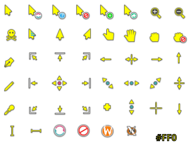
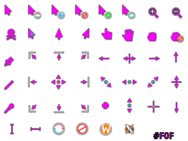

# Breeze Neon · High Visibility Cursors

## preview images:
 &#160; &#160; &#160;

## links and documentation:
* [KDE / Breeze Cursors · GitHub](https://github.com/KDE/breeze/tree/master/cursors)
* [Create your own mouse cursor theme](https://develop.kde.org/docs/features/additional-features/cursor/)
* [kcursorgen and SVG cursors](https://blogs.kde.org/2025/01/12/kcursorgen-and-svg-cursors/)
