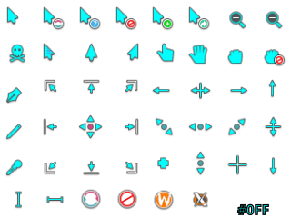

# Breeze Neon · High Visibility Cursors

Variations on the [Breeze Light](https://github.com/KDE/breeze/tree/master/cursors) cursor theme. 
Available colors: _Bright Yellow_, _Cool Cyan_ and _Hot Pink_. 
Available sizes: 12, 18, 24, 30, 36, 42, 48, 54, 60, 66 and 72.

## preview images:
 
 


## generate cursor files:
```sh
rm -rv breeze-???/cursors
kcursorgen --svg-theme-to-xcursor --svg-dir=breeze-0ff/cursors_scalable --xcursor-dir=breeze-0ff/cursors --sizes=24 --scales=0.5,0.75,1,1.25,1.5,1.75,2,2.25,2.5,2.75,3
kcursorgen --svg-theme-to-xcursor --svg-dir=breeze-f0f/cursors_scalable --xcursor-dir=breeze-f0f/cursors --sizes=24 --scales=0.5,0.75,1,1.25,1.5,1.75,2,2.25,2.5,2.75,3
kcursorgen --svg-theme-to-xcursor --svg-dir=breeze-ff0/cursors_scalable --xcursor-dir=breeze-ff0/cursors --sizes=24 --scales=0.5,0.75,1,1.25,1.5,1.75,2,2.25,2.5,2.75,3
```

## package tar archives:
```sh
tar --auto-compress --create --exclude=cursors_scalable --file=breeze-res/breeze-cyan.tar.xz breeze-0ff
tar --auto-compress --create --exclude=cursors_scalable --file=breeze-res/breeze-pink.tar.xz breeze-f0f
tar --auto-compress --create --exclude=cursors_scalable --file=breeze-res/breeze-neon.tar.xz breeze-ff0
```

## links and documentation:
* [Breeze Neon - KDE Store](https://store.kde.org/p/2370995)
* [KDE / Breeze Cursors · GitHub](https://github.com/KDE/breeze/tree/master/cursors)
* [Create your own mouse cursor theme](https://develop.kde.org/docs/features/additional-features/cursor/)
* [kcursorgen and SVG cursors](https://blogs.kde.org/2025/01/12/kcursorgen-and-svg-cursors/)
